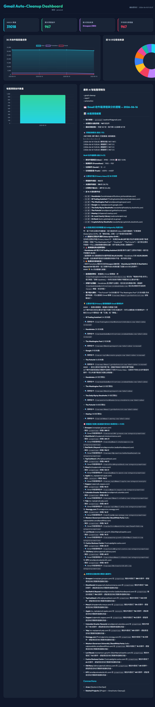

# Gmail Auto-Cleanup & Primary Inbox Analyzer

An automated, safety-first, AI-enhanced email cleanup system and Primary Inbox analyzer for Gmail.

Built using standard Python IMAP libraries (zero external API registration required) and SQLite for trend tracking. Runs weekly to move promotions, social notifications, old purchases, and updates to Trash — while deep-scanning your Primary Inbox to generate AI-powered to-dos, topics, and a premium interactive dashboard.

---

## 📐 Architecture & Workflow

```
┌──────────────────────────────────────────────────────────────────────────────────┐
│                          Gmail Auto-Cleanup Tool                                  │
│                                                                                    │
│  ┌─────────────────────┐   ┌────────────────────────────────────────────────┐     │
│  │  🧹 Cleanup Engine   │   │  📊 Primary Inbox Analyzer                     │     │
│  │  (Pillar 1)         │   │  (Pillar 2)                                    │     │
│  │  • Promotions > 30d │   │  • Scans configurable timeframe (default: 7d)  │     │
│  │  • Social > 7d      │   │  • Analyzes Unread vs Read, top senders        │     │
│  │  • Purchases > 2y   │   │  • Fetches body snippets for content analysis  │     │
│  │  • Updates > 30d    │   │  • Identifies newsletters & clutter senders    │     │
│  │  • Chunks of 500    │   │  • Excludes Do-not-delete labeled emails       │     │
│  └──────────┬──────────┘   └───────────────────────┬────────────────────────┘     │
│             │                                      │                               │
│             └──────────────────┬───────────────────┘                               │
│                                ▼                                                   │
│                    ┌───────────────────────┐                                       │
│                    │   💾 SQLite Analytics  │                                       │
│                    │   • Run history        │                                       │
│                    │   • Inbox snapshots    │                                       │
│                    │   • Sender stats       │                                       │
│                    │   • Email snippets     │                                       │
│                    └───────────┬───────────┘                                       │
│                                ▼                                                   │
│          ┌─────────────────────────────────────────────┐                           │
│          │  🤖 AI Layer (OpenCode Go / deepseek-v4-flash)│                           │
│          │  • Analyzes metrics + recent email snippets  │                           │
│          │  • Returns structured JSON output            │                           │
│          │  • Suggested To-dos from email content       │                           │
│          │  • Topics to Catch Up (news, events, tasks)  │                           │
│          │  • Suggested clutter senders → auto-labels   │                           │
│          └─────────────────────┬───────────────────────┘                           │
│                                ▼                                                   │
│        ┌────────────────────────────────────────────────────┐                      │
│        │  📝 Obsidian Weekly Report + 📊 Interactive Dashboard │                      │
│        │  • WoW trends, unsubscribe tips, search queries     │                      │
│        │  • Suggested To-dos checklist                       │                      │
│        │  • Topics to Catch Up (past 7 days)                 │                      │
│        │  • Premium two-column tabbed HTML dashboard         │                      │
│        └────────────────────────────────────────────────────┘                      │
└──────────────────────────────────────────────────────────────────────────────────┘
```

**Workflow steps:**

1. **Rule-Based Cleanup:** Connects to Gmail IMAP, applies cleanup rules (Promotions, Social, Purchases, Updates), skipping anything labeled `Do-not-delete`.
2. **Primary Inbox Profiling:** Fetches headers and body snippets from recent Primary Inbox emails.
3. **SQLite Logging:** Records run history, inbox snapshots, sender stats, and email snippets to `~/.gmail_cleanup/analytics.db`.
4. **AI Deep Analysis:** Sends metrics + email body snippets to the AI layer, receiving a structured JSON response with a report, suggested to-dos, topics to catch up, and clutter senders to label.
5. **Auto-Labeling:** Applies the `Review-to-delete` Gmail label to emails from AI-identified clutter senders.
6. **Obsidian Report:** Writes `Weekly-Cleanup-Report-YYYY-MM-DD.md` to your vault's `00 - Inbox/Agent_Output/`.
7. **Dashboard:** Generates a static `dashboard.html` with interactive charts, email list, AI report, to-dos, and topics tabs.

---

## 🚀 Installation & Setup

This tool uses [uv](https://github.com/astral-sh/uv) for fast, reliable package management.

### 1. Clone & Install
```bash
git clone https://github.com/sadrian94/gmail-auto-cleanup.git
cd gmail-auto-cleanup
uv pip install -e .[test,ai]
```

### 2. Configure Settings (`config.yaml`)
Create a configuration file at `~/.gmail_cleanup/config.yaml` or directly in the workspace root as `config.yaml`.

```yaml
accounts:
  personal: your_email@gmail.com

# Path to write weekly report markdown files directly into Obsidian
obsidian_vault_path: "C:/Users/yourname/Obsidian/My_Vault"

# Cleanup rules — configure days-old threshold and action per category
rules:
  promotions:
    days: 30
    action: TRASH
    enabled: true
  social:
    days: 7
    action: TRASH
    enabled: true
  purchases:
    days: 730  # 2 years — uses label:purchases + receipt/invoice subject fallback
    action: TRASH
    enabled: true
  updates:
    days: 30
    action: TRASH
    enabled: true

# Gmail labels auto-created at session start if missing
labels:
  review_to_delete: "Review-to-delete"   # AI-suggested clutter → applied automatically
  do_not_delete: "Do-not-delete"         # Emails to never touch — excluded from all scans

# AI Insights service — supports "gemini" or "opencoder-go"
ai:
  provider: "opencoder-go"
  model: "deepseek-v4-flash"
  api_key: "sk-..."
  base_url: "https://opencode.ai/zen/go/v1"
```

### 3. Secure Credentials Setup (Keyring)
Credentials are saved inside your operating system's Keychain/Credential Locker — never plaintext on disk.

Generate a **Gmail App Password** (Google Account → Security → App Passwords), then register it:
```bash
gmail-cleanup --account personal --set-password
```

---

## 💻 CLI Reference

### 🔍 Dry-Run Mode (Safe — no changes)
```bash
# Scan and profile Primary Inbox (past 7 days by default)
gmail-cleanup --account personal --analytics-deep

# Scan with a custom Primary Inbox timeframe
gmail-cleanup --account personal --analytics-deep --primary-days 30

# Scan all-time Primary Inbox (may be slow on large inboxes)
gmail-cleanup --account personal --analytics-deep --primary-days all
```

### 🧹 Execution Mode (Clean + AI Summary)
```bash
# Full weekly run: cleanup + deep analytics + AI report + auto-label clutter
gmail-cleanup --account personal --analytics-deep --apply --ai-summary

# Dry-run with AI summary (no deletions, only label and report)
gmail-cleanup --account personal --analytics-deep --ai-summary --primary-days 7
```

### 📊 Dashboard
Generate the static interactive HTML dashboard:
```bash
gmail-cleanup --account personal --dashboard
# or
make dashboard
```

This compiles statistics from the SQLite database and generates `dashboard.html` in the workspace root. Double-click to open in any browser — no local server needed.

The dashboard features:
- **KPI cards:** Inbox, Promotions, Social counts + lifetime cleaned total
- **Left panel tabs:** 📊 走勢分析 (Trend charts, Doughnut sender chart, Weekly bar chart) | ✉️ 近期郵件 (Recent email list with subjects & snippets)
- **Right panel tabs:** 報告 (Full AI weekly report) | 待辦 (AI-suggested to-dos as interactive checkboxes) | 摘要 (Topics to Catch Up as pinned items)

#### 📈 Dashboard Preview


### 📝 Reports
```bash
# Print raw JSON weekly metrics
gmail-cleanup --report

# Print human-readable summary to terminal
gmail-cleanup --report-text
```

---

## 🏷️ Smart Labeling System

The tool automatically manages two Gmail labels at startup:

| Label | Purpose |
|---|---|
| `Review-to-delete` | Applied to emails from AI-identified clutter senders. Review manually in Gmail and delete when ready. |
| `Do-not-delete` | Apply this manually to any email you want permanently protected. The tool will never scan, analyze, or touch these emails. |

Labels are **automatically created** if they don't exist in your Gmail account.

---

## ⏱️ Scheduling (Weekly Automation)

### Windows (Task Scheduler)
- **Program/Script:** `powershell.exe`
- **Arguments:** `-ExecutionPolicy Bypass -File C:\path\to\workspace\scripts\run-weekly.ps1`

### macOS / Linux (cron)
```cron
# Run every Sunday at 09:00
0 9 * * 0 /bin/bash /path/to/workspace/scripts/run-weekly.sh >> /path/to/workspace/cleanup.log 2>&1
```

---

## 🔒 Safety First Principles

- **No Primary Inbox Auto-deletion:** The tool only scans Primary Inbox headers and snippets to recommend improvements. It will **never** automatically delete anything in your Primary Inbox.
- **Do-not-delete Exclusion:** Any email labeled `Do-not-delete` is permanently excluded from all cleanup rules, scans, analytics, and AI labeling.
- **Review-to-delete Buffer:** AI-suggested clutter is labeled — never deleted. You retain full control over what actually gets removed.
- **Gmail Trash Buffer:** Matching emails from cleanup rules are moved to Gmail's native `Trash`, not permanently deleted. They remain for 30 days as a recovery buffer.
- **Copy-Paste Search Queries:** The weekly report includes ready-to-use Gmail search strings (e.g., `from:noreply@github.com label:inbox is:unread`) to batch-archive or delete safely.
