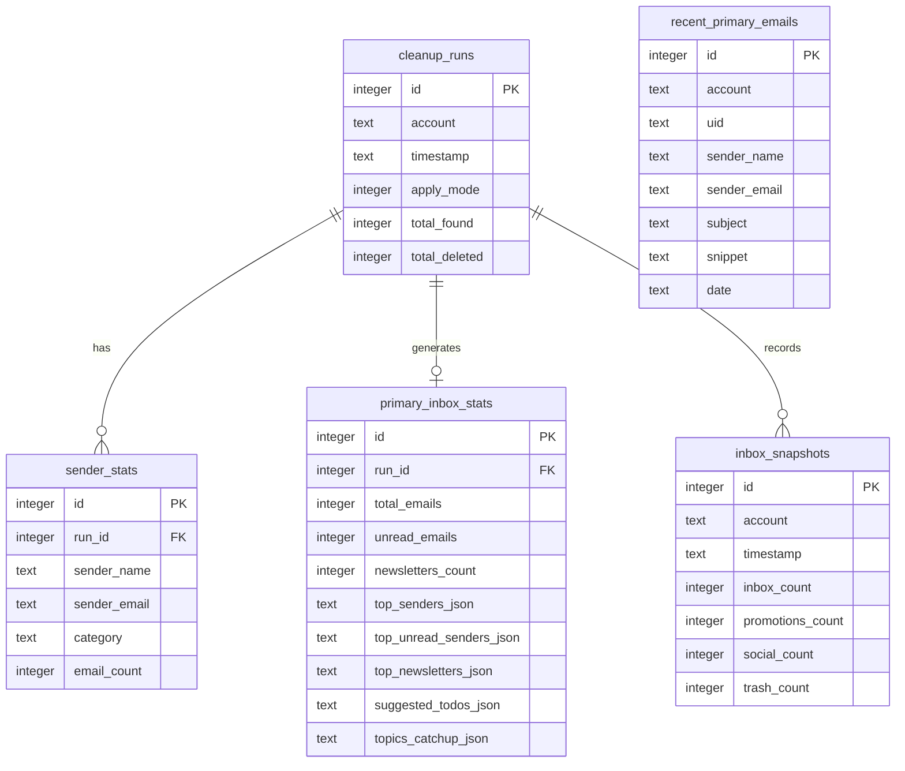

# Gmail Auto-Cleanup Architecture Design

This document details the architectural layout, core design decisions, and database schema of the Gmail Auto-Cleanup and Primary Inbox Analyzer tool.

---

## 📐 Overview

The system is built around a **two-pillar architecture** with an AI layer and reporting stack on top. It connects to Gmail using securely stored credentials (via system Keychain/keyring) and uses IMAP to scan, organize, and analyze messages.

```
┌──────────────────────────────────────────────────────────────────────────────────┐
│                          Gmail Auto-Cleanup Tool                                  │
│                                                                                    │
│  ┌─────────────────────┐   ┌────────────────────────────────────────────────┐     │
│  │  🧹 Cleanup Engine   │   │  📊 Primary Inbox Analyzer                     │     │
│  │  (Pillar 1)         │   │  (Pillar 2)                                    │     │
│  │  • Promotions > 30d │   │  • Scans configurable timeframe (default: 7d)  │     │
│  │  • Social > 7d      │   │  • Analyzes Unread vs Read, top senders        │     │
│  │  • Purchases > 2y   │   │  • Fetches body snippets for content analysis  │     │
│  │  • Updates > 30d    │   │  • Identifies newsletters & clutter senders    │     │
│  │  • Chunks of 500    │   │  • Excludes Do-not-delete labeled emails       │     │
│  └──────────┬──────────┘   └───────────────────────┬────────────────────────┘     │
│             │                                      │                               │
│             └──────────────────┬───────────────────┘                               │
│                                ▼                                                   │
│                    ┌───────────────────────┐                                       │
│                    │   💾 SQLite Analytics  │                                       │
│                    │   • cleanup_runs       │                                       │
│                    │   • inbox_snapshots    │                                       │
│                    │   • sender_stats       │                                       │
│                    │   • primary_inbox_stats│                                       │
│                    │   • recent_primary_    │                                       │
│                    │     emails (snippets)  │                                       │
│                    └───────────┬───────────┘                                       │
│                                ▼                                                   │
│          ┌─────────────────────────────────────────────┐                           │
│          │  🤖 AI Layer (OpenCode Go / deepseek-v4-flash)│                           │
│          │  • Structured JSON output (4 fields)         │                           │
│          │  • report_markdown                           │                           │
│          │  • suggested_clutter_senders → auto-labels   │                           │
│          │  • suggested_todos                           │                           │
│          │  • topics_catchup                            │                           │
│          └─────────────────────┬───────────────────────┘                           │
│                                ▼                                                   │
│        ┌────────────────────────────────────────────────────┐                      │
│        │  📝 Obsidian Weekly Report + 📊 Interactive Dashboard │                      │
│        └────────────────────────────────────────────────────┘                      │
└──────────────────────────────────────────────────────────────────────────────────┘
```

---

## 🧹 Pillar 1: Cleanup Engine

### Rule-Based Filters

All cleanup rules use Gmail's `X-GM-RAW` IMAP extension to execute full Gmail search syntax on the server, ensuring fast and accurate results.

| Rule | Gmail Query | Default Threshold |
|---|---|---|
| `promotions` | `category:promotions older_than:Nd` | 30 days |
| `social` | `category:social older_than:Nd` | 7 days |
| `purchases` | `label:purchases older_than:Nd` (falls back to subject keywords: receipt, invoice, billing, order confirmation) | 730 days (2 years) |
| `updates` | `label:updates older_than:Nd` | 30 days |

All rules automatically append `-label:Do-not-delete` to exclude protected emails.

### Trash Workflow (Safety-First)

Gmail's IMAP implementation requires a specific sequence to move messages to Trash without permanently deleting them:

1. Add `\Trash` Gmail label: `UID STORE <uids> +X-GM-LABELS \\Trash`
2. Mark as deleted: `UID STORE <uids> +FLAGS \\Deleted`
3. Expunge to commit: `EXPUNGE`

This mirrors the Gmail UI behavior and preserves a **30-day recovery window** in the native Trash folder.

### Dynamic Folder Resolution

Gmail folder names vary by account language (e.g., `[Gmail]/Trash` in English, `[Gmail]/Corbeille` in French). The tool scans IMAP `LIST` attributes at session start to dynamically resolve `\\Trash` and `\\All` to the correct folder names.

### Chunked Operations

IMAP commands have maximum string length limits. All fetch, store, and move operations are automatically chunked into batches of **500 UIDs** to ensure session stability with large inboxes.

---

## 📊 Pillar 2: Primary Inbox Analyzer

### Header Scanning

Fetches `From`, `Subject`, `Date`, and `List-Unsubscribe` headers (via `BODY.PEEK[HEADER.FIELDS]`) for emails matching:
```
label:inbox category:primary newer_than:Nd -label:Do-not-delete
```
The timeframe `N` is configurable via `--primary-days` (default: `7`, accepts integers or `all`).

### Body Content Scanning (Deep Analysis)

For the most recent 100 emails, the tool fetches the full body text via `BODY.PEEK[TEXT]` and extracts clean `text/plain` snippets (up to 400 characters each) using a robust MIME parser:

- Detects multipart MIME boundary delimiters in raw body bytes
- Prepends the appropriate `Content-Type` header to allow correct parsing
- Falls back to HTML-stripping via regex if needed
- Collapses whitespace for compact representation

These snippets are stored in the `recent_primary_emails` SQLite table and sent to the AI layer for deep content understanding.

### Newsletter Detection

The `List-Unsubscribe` header is parsed to extract HTTP unsubscribe URLs, which are used to classify senders as "newsletter" sources.

---

## 🤖 AI Layer (Layer 2)

The AI layer takes inbox metrics and email snippets as input and returns a **structured JSON response** with four fields:

```json
{
  "report_markdown": "...",
  "suggested_clutter_senders": ["noreply@foo.com", "..."],
  "suggested_todos": ["Follow up on I-485 biometrics", "..."],
  "topics_catchup": ["SpaceX acquires AI startup for $60B", "..."]
}
```

### Providers

| Provider | Config value | Notes |
|---|---|---|
| OpenCode Go | `opencoder-go` | Uses `urllib.request` HTTP POST to OpenAI-compatible endpoint. Recommended. |
| Gemini | `gemini` | Uses `google-genai` SDK. Requires `pip install gmail-cleanup[ai]`. |

### Auto-Labeling

After parsing `suggested_clutter_senders`, the tool:
1. Builds a Gmail search query combining all suggested sender addresses
2. Fetches matching UIDs from the Primary Inbox (past 30 days)
3. Applies the `Review-to-delete` label to all matched emails

---

## 🏷️ Label Management

Two Gmail labels are managed automatically:

| Label | Created at | Purpose |
|---|---|---|
| `Review-to-delete` | Session startup (if missing) | AI applies this to clutter. User reviews and decides to delete. |
| `Do-not-delete` | Session startup (if missing) | User applies manually. Tool excludes these from all scans and cleanup. |

Labels are checked via IMAP `LIST` and created with `CREATE` if absent.

---

## 💾 SQLite Database Schema (`~/.gmail_cleanup/analytics.db`)



### Table Descriptions

| Table | Purpose |
|---|---|
| `cleanup_runs` | Metadata per run: account, timestamp, dry-run vs apply mode, counts |
| `inbox_snapshots` | Folder size snapshot after each run for WoW trend tracking |
| `sender_stats` | Breakdown of senders targeted by cleanup rules |
| `primary_inbox_stats` | Structured JSON summaries of Primary Inbox; stores AI to-dos & topics |
| `recent_primary_emails` | Per-email body snippet store for AI content analysis |

The database uses automatic schema migration: new columns are added via `ALTER TABLE` if an older schema version is detected.

---

## 📊 Dashboard (`dashboard.html`)

A static, double-click-to-open HTML dashboard generated from SQLite data. Zero npm, zero local server required.

### Layout

```
┌──────────────────────────────────────────────────────────┐
│  KPI Cards: Inbox | Promotions | Social | Lifetime Clean  │
├──────────────────────────────┬───────────────────────────┤
│  Left Panel (tabbed)         │  Right Panel (tabbed)     │
│                              │                           │
│  📊 分析 tab:                │  報告 tab:                │
│  • 30-day Inbox trend chart  │  Full weekly AI report    │
│  • Top senders doughnut      │  (with Markdown parser)   │
│  • Weekly cleanup bar chart  │                           │
│                              │  待辦 tab:                │
│  ✉️ 近期郵件 tab:             │  AI to-dos as checkboxes  │
│  • Recent Primary Inbox list │                           │
│  • Subject + body snippets   │  摘要 tab:                │
│                              │  Topics to Catch Up pins  │
└──────────────────────────────┴───────────────────────────┘
```

### Key Features & Technology

1. **Interactive Theme Selection:**
   - Supports 5 premium custom themes:
     - **Slate:** Sleek dark glassmorphism.
     - **Nord:** Clean arctic blue aesthetic.
     - **Cyberpunk:** Vibrant neon and high-contrast dark.
     - **Forest:** Deep emerald and organic hues.
     - **Sunset:** Warm twilight tones.
   - Dynamic update flow: Clicking a theme button switches the document variables and updates the Chart.js instances (axis ticks, grids, dataset colors, and tooltips) on the fly without refreshing the page.

2. **Full Localization (zh/en):**
   - Interactive language switcher toggle in the header.
   - Translates all dashboard titles, tab names, KPI cards, table headers, chart labels, tooltip text, and AI status elements dynamically.
   - Uses data-i18n attributes (`data-en` and `data-zh`) for all key DOM nodes.

3. **Persistent User Settings:**
   - Active language and theme selections are persisted in browser `localStorage`, ensuring preferences survive page reloads and report regenerations.

4. **Dynamic AI Markdown Table Parser:**
   - Custom client-side JavaScript parser translates markdown headings, lists, bold text, and HTML-escaped characters from the LLM weekly report.
   - Specially handles markdown tables, rendering them as beautifully styled, responsive HTML tables.

5. **Chart.js & Styling:**
   - **Chart.js** (via CDN) for responsive line, doughnut, and bar charts.
   - **Vanilla CSS** with backdrop-filters, dynamic linear gradients, and layout curves.
   - **Google Fonts** (Outfit) for clean modern typography.
   - Full HTML-escaping on all dynamic values to prevent DOM structure corruption or XSS from email content.

---

## 🔒 Security Practices

1. **Keychain Integration:** `keyring` library queries the OS Credential Locker (Keychain on macOS, Credential Manager on Windows). Credentials are never stored plaintext on disk.
2. **Gitignored Secrets:** `config.yaml` and `*.db` files are excluded from version control.
3. **App Passwords:** Requires Gmail App Passwords, not main account passwords.
4. **Read-only Fetch:** Header and body fetches use `BODY.PEEK` (not `BODY`), preventing accidental "mark as read" side effects.
5. **No Primary Inbox Deletion:** The Primary Inbox Analyzer only reads — it never deletes, archives, or modifies Primary Inbox messages directly.
