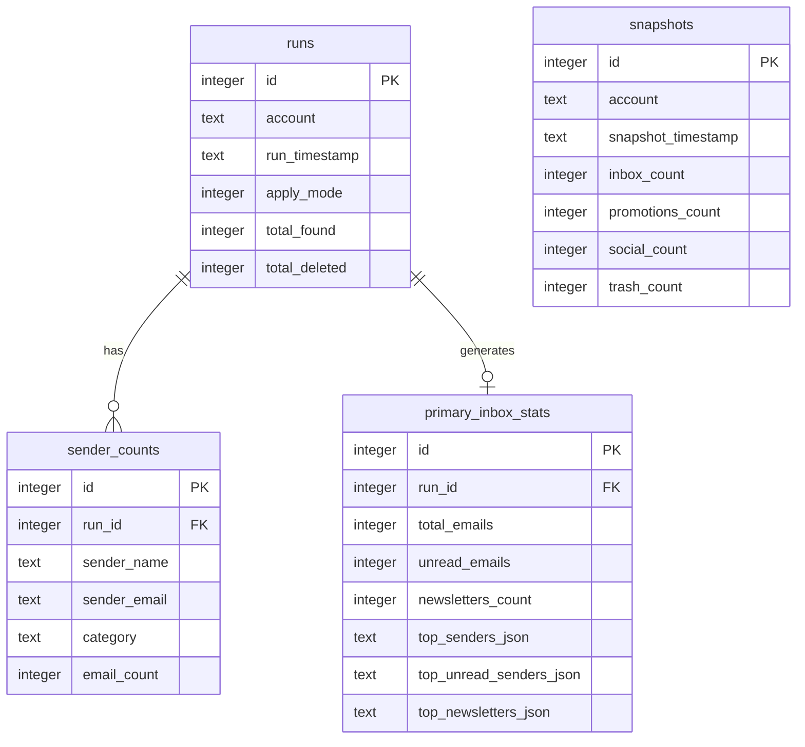

# Gmail Auto-Cleanup Architecture Design

This document details the architectural layout, core design decisions, and database schema of the Gmail Auto-Cleanup and Primary Inbox Analyzer tool.

---

## 📐 Overview

The system is designed around a **two-pillar architecture** with a reporting and analytics layer built on top. It connects to Gmail using securely stored credentials (via system Keychain/keyring) and uses IMAP to scan and organize messages.

```
┌────────────────────────────────────────────────────────────────────────┐
│                        Gmail Auto-Cleanup Tool                         │
│                                                                        │
│   ┌─────────────────────┐  ┌──────────────────────────────────────┐    │
│   │  🧹 Cleanup Engine   │  │  📊 Primary Inbox Analyzer           │    │
│   │  (Pillar 1)         │  │  (Pillar 2)                          │    │
│   │  • Promotions > 30d │  │  • Scans past 30 days of Primary     │    │
│   │  • Social > 7d      │  │  • Analyzes Unread vs Read           │    │
│   │  • Receipts > 2y    │  │  • List-Unsubscribe Header Parser    │    │
│   │  • Chunks of 500    │  │  • Identifies top newsletter senders │    │
│   └─────────┬───────────┘  └──────────────────┬───────────────────┘    │
│             │                                 │                        │
│             └────────────────┬────────────────┘                        │
│                              ▼                                         │
│                   ┌──────────────────────┐                             │
│                   │  💾 SQLite Analytics │                             │
│                   │  • Save run history  │                             │
│                   │  • Log inbox sizes   │                             │
│                   └──────────┬───────────┘                             │
│                              ▼                                         │
│                   ┌──────────────────────┐                             │
│                   │   📝 Weekly Report   │                             │
│                   │  • Growth WoW trends │                             │
│                   │  • Unsubscribe tips  │                             │
│                   │  • Copy-paste Search │                             │
│                   └──────────────────────┘                             │
└────────────────────────────────────────────────────────────────────────┘
```

---

## 🧹 Pillar 1: Cleanup Engine (IMAP Session & Trash Workflow)

Standard IMAP protocols lack a unified way to "trash" emails across different providers. In Gmail, deleting emails directly by marking them as `\Deleted` and expunging them removes them permanently from All Mail. To make the cleanup process safety-first, the tool implements a **Trash Workflow** that mimics the official Gmail UI deletion.

### 1. Dynamic Folder Localization
Gmail labels (like `Trash` or `All Mail`) vary depending on the account's language settings (e.g., `[Gmail]/Trash` in English, `[Gmail]/Corbeille` in French). 
The tool dynamically resolves the correct folders using IMAP namespace attributes:
- Scans `LIST` attributes for `\Trash` and `\All` flags.
- Resolves the actual server folder name (e.g., `[Gmail]/Trash`) at runtime.

### 2. Trash Sequence
To move a message to Trash without deleting it permanently immediately:
1. Copy the message to the resolved Trash folder:
   ```imap
   UID COPY <uids> "[Gmail]/Trash"
   ```
2. Mark the message as deleted in its original folder:
   ```imap
   UID STORE <uids> +FLAGS \Deleted
   ```
3. Expunge the folder to commit:
   ```imap
   EXPUNGE
   ```

### 3. Chunking Large Batches
IMAP commands have maximum string length limits. Executing commands on thousands of UIDs at once can crash the session. The cleanup engine automatically chunks operations into batches of **500 messages** to ensure reliability.

---

## 📊 Pillar 2: Primary Inbox Analyzer & SQLite Database

The Primary Inbox Analyzer processes the past 30 days of emails in the user's `INBOX` to establish email patterns, newsletter volume, and key senders.

### SQLite Database Schema
The database tracks history and trends locally at `~/.gmail_cleanup/analytics.db`. It contains four main tables:



1. **`runs`**: Tracks the metadata of each cleanup execution.
2. **`snapshots`**: Stores raw folder counts (Inbox, Promotions, Social, Trash) taken after each run to calculate Week-over-Week growth.
3. **`sender_counts`**: Stores the breakdown of senders targeted by cleanup rules (useful for understanding where clutter comes from).
4. **`primary_inbox_stats`**: Stores structured JSON summaries of Primary Inbox senders and newsletters.

---

## 🤖 Reporting Layer (AI Summary & Markdown Generation)

After a run is finished:
1. The reporting module queries the SQLite database to compare the latest snapshot with previous snapshots.
2. It calculates Week-over-Week (WoW) growth rates and identifies senders who have sent an unusually high number of emails.
3. It parses `List-Unsubscribe` headers from newsletters to present quick unsubscribe URLs.
4. Generates a beautifully formatted Markdown report containing Gmail search queries for copy-pasting (e.g., `from:noreply@github.com label:inbox is:unread`).
5. Writes the report directly to the user's Obsidian Vault if specified in `config.yaml`.

---

## 🔒 Security Practices

1. **Keychain Integration:** The tool utilizes the Python `keyring` library to query the OS Credential Locker (Keychain on macOS, Credential Manager on Windows, Secret Service on Linux). Standard credentials are never stored in plaintext on disk.
2. **Ignored Configuration Files:** Config files containing email addresses (`config.yaml`) and database files (`*.db`) are added to `.gitignore` to prevent leakage into GitHub repositories.
3. **App Passwords:** Requires Gmail App Passwords rather than main account passwords.
